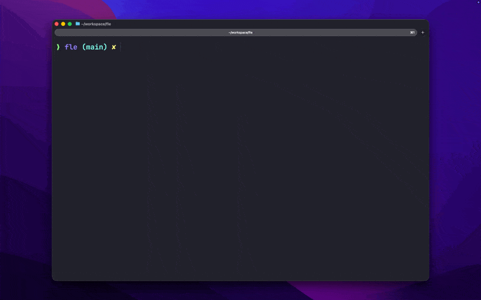

# panefleet

Panefleet is a tmux workboard for parallel agent panes.

It gives you one popup board to:

- see which panes are `RUN`, `WAIT`, `DONE`, `IDLE`, `STALE`, or `ERROR`
- jump straight to the pane you want
- preview what is happening without switching windows blindly
- track Codex, Claude Code, OpenCode, and plain shell panes in one place



## Why

When you run several agent sessions at once, the hard part is not opening panes.
The hard part is remembering which pane needs approval, which one finished, and
which one is just stale noise. Panefleet keeps that state visible so navigation
and intervention stay cheap.

## Install

### Homebrew

```bash
brew tap alnah/tap
brew install alnah/tap/panefleet
panefleet install all
panefleet doctor --install
panefleet preflight
```

Reload tmux config or restart tmux, then open the board with `prefix + P`.

### Source install

```bash
git clone https://github.com/alnah/panefleet.git
cd panefleet
make install all
make doctor
```

## What You Get

- `prefix + P`: open the board
- `prefix + T`: open the theme picker
- automatic pane state detection
- provider integrations for Codex, Claude Code, and OpenCode
- provider usage columns when metrics are available: `TOKENS` and `CTX%`
- a Go-backed board and state runtime, with the shell runtime still available as
  a stable outer CLI surface

Install targets:

- `core`: heuristic-only runtime, no provider bridge
- `codex`: core + Codex integration
- `claude`: core + Claude integration
- `opencode`: core + OpenCode integration
- `all`: core + all provider integrations

## Daily Use

Open the board, type to filter, then use:

- `enter`: jump to the selected pane
- `ctrl+s`: toggle `STALE` on the selected pane
- `esc`: quit the board
- `up` / `down`: move in filtered results
- `backspace`: delete one character in the search prompt
- `alt+backspace`: delete one word in the search prompt
- `ctrl+backspace`: clear the full search prompt

The board refreshes while it stays open. Preview updates follow the selected
pane.

## State Model

| State | Meaning |
| --- | --- |
| `RUN` | active work in progress |
| `WAIT` | approval, chooser, or external input is blocking progress |
| `DONE` | work appears complete and the pane has returned to a ready prompt |
| `IDLE` | pane is alive but there is no strong sign of active work |
| `STALE` | pane has been left open beyond the configured stale threshold |
| `ERROR` | pane exited with a non-zero status |

Resolution order:

1. manual override
2. fresh provider adapter state in `auto` mode
3. live provider heuristics
4. generic shell/dead-pane fallback

## Configuration

Panefleet mainly uses tmux global options:

```tmux
set -g @panefleet-theme panefleet-dark
set -g @panefleet-done-recent-minutes 10
set -g @panefleet-stale-minutes 45
set -g @panefleet-agent-status-max-age-seconds 600
set -g @panefleet-adapter-mode heuristic-only
```

Main options:

| Option | Default | Purpose |
| --- | --- | --- |
| `@panefleet-theme` | `panefleet-dark` | board theme |
| `@panefleet-done-recent-minutes` | `10` | how long `DONE` stays visible |
| `@panefleet-stale-minutes` | `45` | when `IDLE` becomes `STALE` |
| `@panefleet-agent-status-max-age-seconds` | `600` | freshness window for provider states |
| `@panefleet-adapter-mode` | `heuristic-only` | `heuristic-only` or `auto` |

Useful environment variables:

| Variable | Purpose |
| --- | --- |
| `PANEFLEET_DB_PATH` | SQLite path for the Go runtime |
| `PANEFLEET_EVENT_LOG_DIR` | JSONL bridge payload/decision logs |
| `PANEFLEET_RUNTIME_LOG_DIR` | shell runtime log directory |
| `PANEFLEET_OBS_VERBOSE` | verbose Go `run` sync logs |
| `PANEFLEET_REQUIRE_BRIDGE` | make ops healthcheck fail when bridge is missing |

## Troubleshooting

Start here:

```bash
panefleet doctor
panefleet doctor --install
panefleet preflight
scripts/ops-healthcheck.sh
```

Go runtime health:

```bash
scripts/panefleet-go health --check liveness
scripts/panefleet-go health --check readiness
```

Notes:

- `readiness` is expected to fail outside tmux
- `doctor --install` is the fastest way to inspect integration drift
- `state-show --pane %123` is the fastest way to understand why one pane is
  showing the wrong state

Common checks:

- board does not open:
  - rerun `panefleet preflight`
  - rerun `panefleet doctor --install`
  - confirm tmux bindings were installed
- one provider integration is missing:
  - rerun `panefleet install codex|claude|opencode`
- a pane state looks wrong:
  - run `bin/panefleet state-show --pane %pane`
  - inspect `final.status`, `final.source`, and `final.reason`

## Operations

Health:

```bash
scripts/ops-healthcheck.sh
PANEFLEET_REQUIRE_BRIDGE=1 scripts/ops-healthcheck.sh
```

Backup the Go runtime DB:

```bash
make backup-go-db
```

Restore a DB snapshot:

```bash
make restore-go-db FILE=/absolute/path/to/panefleet-YYYYMMDDTHHMMSSZ.db
```

Resync live state from tmux:

```bash
scripts/panefleet-go sync-tmux --source ops:backfill
```

## Development

Main local quality gate:

```bash
./scripts/test.sh
```

This runs:

- `go test ./...`
- `go test -race ./cmd/panefleet-agent-bridge`
- shell linting
- shell regression contracts
- install contract tests

Useful maintainer commands:

```bash
make doctor
make health
make bridge
make bridge-download
make release-check
```

## Architecture

High-level layout:

- `bin/panefleet`: stable shell CLI entrypoint used by users and tmux hooks
- `lib/panefleet/`: shell runtime, UI, integrations, and ops helpers
- `cmd/panefleet`: Go runtime for ingestion, sync, health, and Bubble Tea TUI
- `cmd/panefleet-agent-bridge`: provider event bridge
- `internal/state`: reducer rules and domain statuses
- `internal/panes`: state service and subscriptions
- `internal/store`: SQLite persistence
- `internal/tmuxctl`: tmux adapter
- `internal/board`: board read model and metrics assembly
- `internal/tui`: Bubble Tea UI

The design rule is simple: state rules live in Go, shell remains an adapter and
operator surface.
